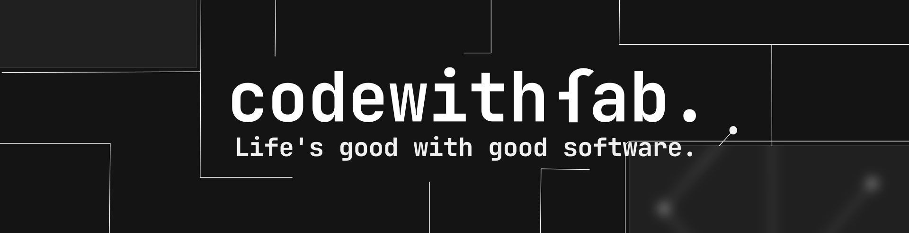

Hi

My name is CodeWithFab (Mackgame4)
==========================

------------------

<b>
I am a software engineer with a passion for developing and designing software.
Studying "Informatic Engineering", IT, where I am learning about the fundamentals of computers, algorithms, hardware, data science, and software engineering.
I am also a full stack developer with experience as freelance in web development and mobile development and many more.
</b>

* 🌍  I'm from  **Portugal**
* 🖥️  See my **work & blog** at [**my portfolio**](https://codewithfab.vercel.app/)

## 🌐 Socials

## 💻 Tech Stack

\

\

\

\

\

<!--
<h1 align="center">
    
</h1>
-->
<!--
## 📊 GitHub Stats
 
 

-->
<!--
## 🏆 GitHub Trophies

-->
<!--
### 🔝 Top Contributed Public Repo

-->
<!--
## 💰 Support Us
<ul style="list-style-type: none; margin: 0;">
<li style="display: inline-block; margin-right: 0.25rem;"></li>
</ul>
-->

